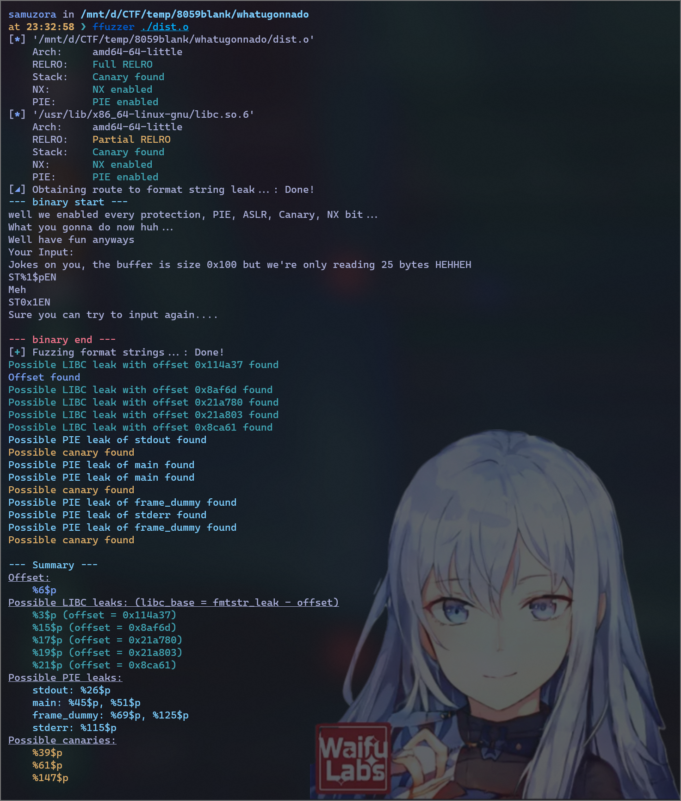

# samuzora

> *:sparkles: Neovim for life :sparkles:*

---

Konnichiwassup! I'm mostly into CTFs and Python development. In my free time, I attempt to work on my 
many unfinished projects (but end up over-configuring my init.vim instead). 

## :triangular_flag_on_post: CTFs :triangular_flag_on_post:

If I'm not busy mugging for my studies, you can usually find [me](https://ctftime.org/team/177451) playing in CTFs over the weekend. 

I main Web and Pwn, and the occasional low-hanging crypto challenge. 
Also have some decent experience with Pyjails!

### Notable wins

#### 2021

* YCEP - 3rd place
* MetaRed CTF - 1st place
* idekCTF - 3rd place in academic category

#### 2022

* VU Cyberthon - 9th place
* Sieberrsec - 3rd place
* Whitehacks - 3rd place
* Imperial CTF - 13th place
* Winja CTF - 3rd place

---

## Projects 

### [ffuzzer](https://github.com/samuzora/ffuzzer)

ffuzzer is a CLI format-string fuzzer for CTF Pwn challenges. Its use case is pretty niche, 
specifically *full RELRO format string challs with  buffer overflow*. 

However, it does find your offset as well, which can be applied to general format string writes (nothing that Pwntools can't
already do). 

It can fuzz:

1. Offset of input on stack
2. Canary offset (pretty accurate!)
3. PIE base (pretty accurate!)
4. LIBC base (not pretty accurate, recommended way should be targeted read via {addr}%{offset}$s)

The main selling point of this tool is basically the no-scripting-required fuzzing.

In this tool, usage is very intuitive: Make your way to the format string vuln in an interactive 
repl and copy-paste the provided payload. *That's it.* 

Once the program detects the format-string leak, it will automatically start fuzzing.

Check out the above link for more details!

---

### [CTF-cord](https://github.com/samuzora/CTF-cord)

CTF-cord is a Discord bot that aims to meet all your CTF needs 
(excluding solving the challs for you)

CTF-cord's backbone is CTFtime. To be honest, I really started off just wanting to scrap CTF data from CTFtime
and display it in a pretty embed. 

When it ran first try, I believed this was a sign from the (Neo)vi(m) deities to extend this bot into a fully-functioning CTF manager.

I've been working on this project for a while now. Once I've ironed out most of the kinks, I'll release the invite link. For now, if you like, you can always clone the repo and host the bot somewhere. Stay posted!
