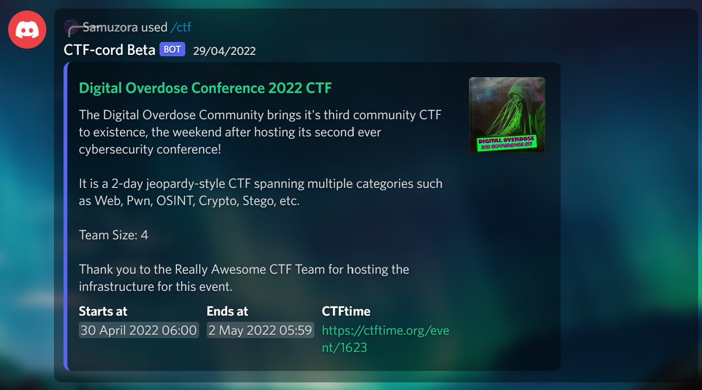

# samuzora

> *:sparkles: Neovim for life :sparkles:*

---

Konnichiwassup! I'm mostly into CTFs and Python development, currently learning Go and ReactJS. In my free time, I attempt to work on my 
many unfinished projects (but end up over-configuring my init.vim instead). 

## :triangular_flag_on_post: CTFs :triangular_flag_on_post:

If I'm not busy mugging for my studies, you can usually find [me](https://ctftime.org/team/177451) playing in CTFs over the weekend. 

I main web and pwn, and the occasional low-hanging crypto challenge. 
Also have some decent experience with Pyjails!

### Notable wins

#### 2021

* YCEP - 3rd place
* MetaRed CTF - 1st place
* idekCTF - 3rd place in academic category

#### 2022

* VU Cyberthon - 9th place
* CTF.SG - 6th place
* Sieberrsec - 3rd place
* Whitehacks - 3rd place
* Imperial CTF - 13th place
* Winja CTF - 3rd place
* YCEP - 1st place
* Codegate 2022 Finals - 4th place
* STACK the Flags 2022 (JC Category) - 3rd place

#### 2023

* Sieberrsec 2023 (Secondary Category) - 1st place

---

## :clipboard: Projects :clipboard:

### [CTF-cord](https://github.com/samuzora/CTF-cord)

CTF-cord is a Discord bot that aims to meet all your CTF needs 
(excluding solving the challs for you)

CTF-cord's backbone is CTFtime. To be honest, I really started off just wanting to scrap CTF data from CTFtime
and display it in an embed. 

Currently, it has many more features, including:

* CTF channel and scheduled event management
* Automated reminders 
* Weekly CTFtime upcoming-CTFs updates
* Point distribution calculation + member percentage contribution

Here's the [invite](https://discord.com/api/oauth2/authorize?client_id=934122115366547526&permissions=541434768464&scope=bot%20applications.commands), feel free to add it to your server :) The bot will be hosted indefinitely, but if it happens to be down someday, you can always clone the repo and host it on your own VPS.

Still undergoing development, feel free to suggest new features :sparkles: or report any bugs :cockroach:

---

### [ffuzzer](https://github.com/samuzora/ffuzzer)

ffuzzer is a CLI format-string fuzzer for CTF Pwn challenges. Its use case is pretty niche, 
specifically *full RELRO format string challs with buffer overflow*. 

However, it does find your offset as well, which can be applied to general format string writes (nothing that Pwntools can't
already do). 

Ultimately, this tool aims to make format string exploitation as easy as can be, with the help of Pwntools. 

It can fuzz:

1. Offset of input on stack
2. Canary offset (pretty accurate!)
3. PIE base (pretty accurate!)
4. Custom strings

The main selling point of this tool is basically the no-scripting-required fuzzing.

In this tool, usage is very intuitive: Make your way to the format string vuln in an interactive 
repl and copy-paste the provided payload. *That's it.* 

Once the program detects the format-string leak, it will automatically start fuzzing.

Check out the link in the header for more details!

---

### ctf-platform
